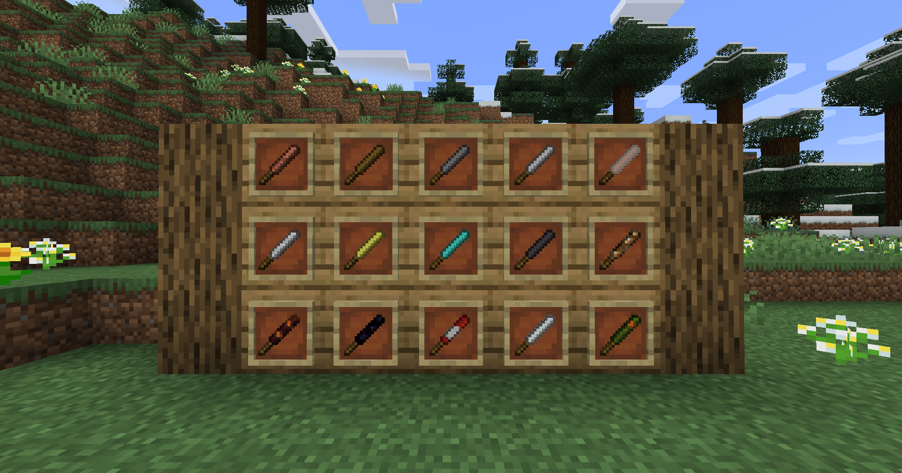

# (Baseball) Bats!

- Ever wanted to push your friend of a cliff without them escaping?
- Ever wanted to just get the creeper away from your house?
- ~~Ever wanted to just launch the cow in front of you to space?~~

***Well now you can!***

## What does this mod add?

This mod adds:
- **15** Bats (**7** of which have special abilities)
- **1** Enchantment (for the bats and swords)

## How do they work and what do they do?

Take a look at this gif! Maybe it helps:

## Where can I find more information about the bats?

Just go to the [wiki](https://github.com/Command17/Bats/wiki)! It's easy, trust me.

---

